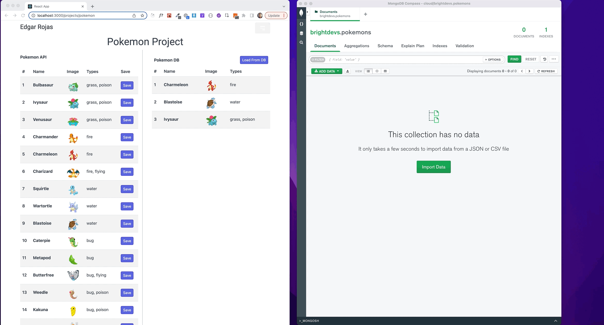

# Projects

## [Pokemon Project Pull Request](https://github.com/e-rojas/react-projects/pull/6)

This project was created using the [Pokemon API](https://pokeapi.co/)

* retrieve a list of 20 Pokémon and display them in a table
* Each Pokémon row should display its “front_default” image, its name, and all of its types
* Store the information in an array in state. Use the following format:

```json
[
    {
    "name": "Ivysaur",
    "image_url":"https://raw.githubusercontent.com/PokeAPI/sprites/master/sprites/pokemon/other/home/2.png",
    "types":[
        "grass", "poison"
    ]
}
]

```

## Back End

This project was created with the use of Express, Typescript, and MongoDB with the following requirements:

* API endpoint to persist a Pokémon's data (name, types, and image URL) to a database.

```typescript
import mongoose from 'mongoose';
import Pokemon from '../interfaces/pokemon.interface';

const pokemonSchema = new mongoose.Schema({
  name: String,
  types: [String],
  image_url: String,
  saved: Boolean,
});

const PokemonModel = mongoose.model<Pokemon & mongoose.Document>(
  'Pokemon',
  pokemonSchema
);
export default PokemonModel;

  ```

* An API endpoint that returns all of the Pokémon's data in the following format:

``` json
[
    {
        "_id": "63573XXXXXXXXXXXXX",
        "name": "Bulbasaur",
        "types": [
            "grass",
            "poison"
        ],
        "image_url": "https://raw.githubusercontent.com/PokeAPI/sprites/master/sprites/pokemon/other/home/1.png",
        "saved": true,
        "__v": 0
    },

]
```

## Full Stack Requirements

* Button added to each table row which calls the backend API endpoint in order to save that Pokémon to your database
* Button added to retrieving data rather from the PokéAPI, retrieves the data from the back end


---



---

## [Front End Pokemon Project Pull Request](https://github.com/e-rojas/react-projects/pull/6)
